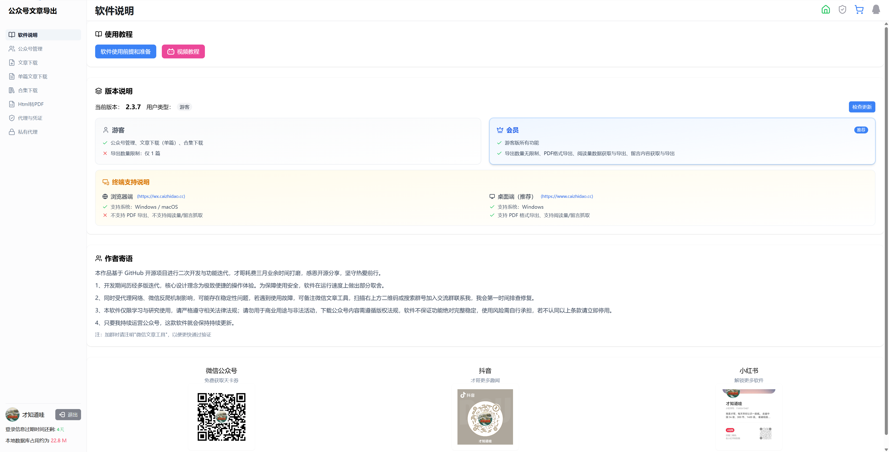
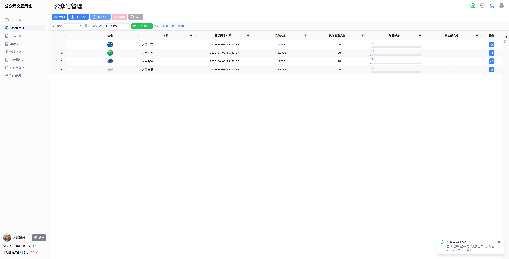
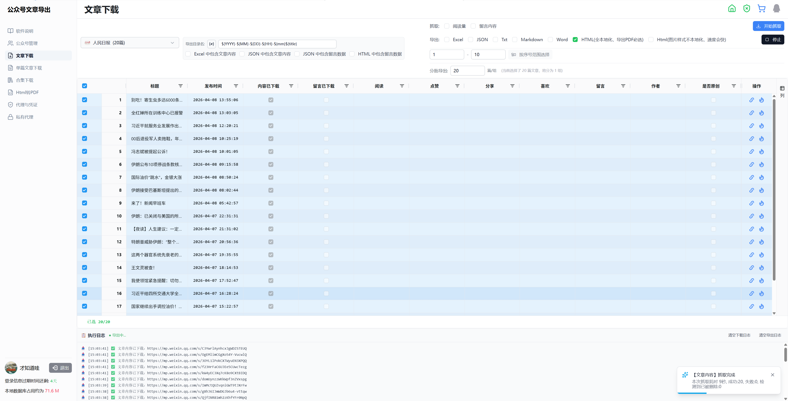
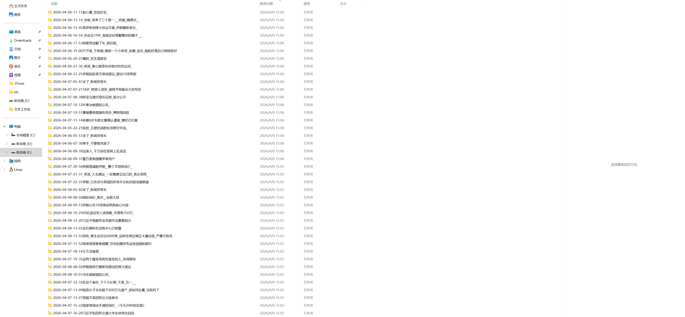
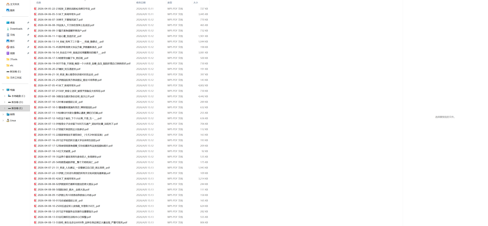
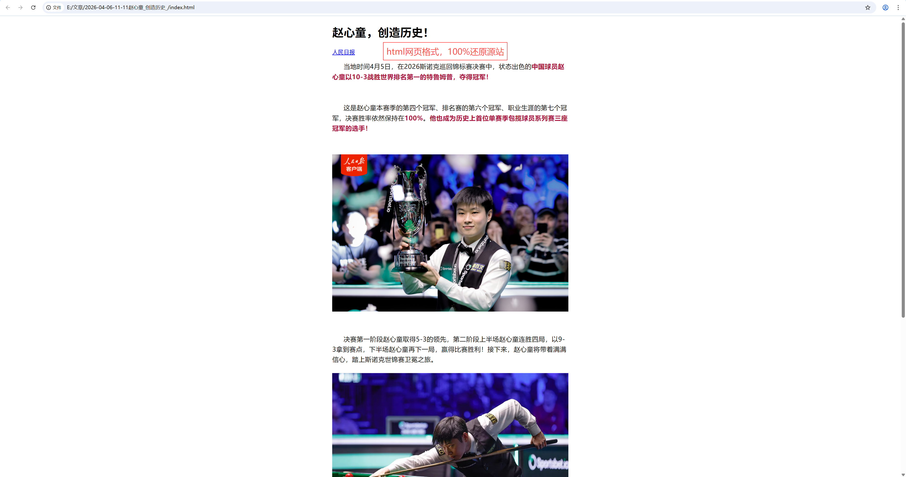

# WeMark - WeChat Official Account Article Export Tool 🚀

> **A WeChat Official Account content scraping and export tool based on MITM + Nuxt 3 + Electron**  
> Supports HTML/JSON/Excel/TXT multi-format export, 100% article layout restoration, batch retrieval of views, comments and other operational data

💬 Welcome to connect: [Cai Ge's Homepage](https://www.caizhidao.cc)

### 🌐 Multi-platform Deployment Solutions
- **Desktop Application** - Electron cross-platform packaging (Windows/macOS/Linux)
- **Web Service** - Nuxt SSR/SSG static deployment
- **Docker Container** - One-click startup, out-of-the-box
- **Cloudflare Workers** - Serverless edge computing deployment

---

## 📸 Screenshots

### Main Interface - Software Info

### Account Management

### Article Download

### Data Export

### Result Display

---

## ✨ Core Features

### 🔍 Intelligent Search & Collection
- **Official Account Fuzzy Search** - Quick positioning of target accounts with keywords
- **Full Article Crawling** - Break through WeChat API limits, batch retrieve historical articles
- **Collection/Album Download** - Download entire topic content with one click
- **Multimedia Support** - Automatically capture image and video sharing messages

### 📊 Deep Data Mining
- **Operational Metrics Export** - Views, likes, shares, wow counts
- **Comment Data Collection** - Support for main comments and reply hierarchy
- **Complete Metadata Preservation** - Publish time, author, original flag, collections

### 🎨 Perfect Format Restoration
- **HTML Pixel-level Restoration** - Inline styles + resource packaging, no difference in offline browsing
- **Multi-format Export** - HTML / JSON / Excel / TXT / Markdown
- **Style Isolation Rendering** - Shadow DOM technology avoids global pollution
- **Code Highlighting Support** - Built-in Monaco Editor with syntax highlighting

### ⚡ High-performance Architecture
- **Concurrency Control** - Smart request queue with P-Queue
- **Incremental Caching** - IndexedDB (Dexie) local persistence, reduce duplicate requests
- **Resume Download** - Large file download supports interruption recovery
- **Proxy Pool Management** - Support public/private proxy configuration

### 🔐 Security Authentication Mechanism
- **MITM Packet Capture** - Automated interception of WeChat login credentials
- **Cookie Session Management** - Multi-account isolation, automatic token refresh
- **QR Code Login** - Official OAuth process, no password input required
- **Encrypted Credential Storage** - Secure storage of sensitive information

### 🌐 Multi-platform Deployment Solutions
- **Desktop Application** - Electron cross-platform packaging (Windows/macOS/Linux)
- **Web Service** - Nuxt SSR/SSG static deployment
- **Docker Container** - One-click startup, out-of-the-box
- **Cloudflare Workers** - Serverless edge computing deployment

---

## 🛠️ Tech Stack

| Category | Technology |
|----------|-----------|
| **Frontend Framework** | [Nuxt 3](https://nuxt.com/) + [Vue 3](https://vuejs.org/) + TypeScript |
| **Desktop** | [Electron](https://www.electronjs.org/) + electron-updater |
| **UI Components** | [@nuxt/ui](https://ui.nuxt.com/) + TailwindCSS |
| **Data Table** | [AG Grid Enterprise](https://www.ag-grid.com/) |
| **State Management** | [Pinia](https://pinia.vuejs.org/) |
| **Local Database** | [Dexie.js](https://dexie.org/) (IndexedDB Wrapper) |
| **HTTP Client** | [ofetch](https://github.com/unjs/ofetch) |
| **File Processing** | [ExcelJS](https://github.com/exceljs/exceljs) · [JSZip](https://stuk.github.io/jszip/) · [html-docx-js](https://github.com/evidenceprime/html-docx-js) |
| **HTML Parsing** | [Cheerio](https://cheerio.js.org/) · [Turndown](https://domchristie.github.io/turndown/) |
| **Code Editor** | [Monaco Editor](https://microsoft.github.io/monaco-editor/) |
| **Man-in-the-Middle Proxy** | [mitmproxy](https://mitmproxy.org/) |
| **Browser Automation** | [Puppeteer](https://pptr.dev/) |
| **Error Monitoring** | [Sentry](https://sentry.io/) |
| **Data Validation** | [Zod](https://zod.dev/) |

## 📖 User Guide

### 1. Account Login

1. Go to "Account Management" page
2. Click "Scan QR Code to Login" button
3. Use WeChat to scan the pop-up QR code
4. Wait for successful authentication notification

### 2. Search Official Accounts

Enter the official account name or keyword in the search box, and the system will return matching results in real-time.

### 3. Batch Export Articles

1. Select target official account
2. Set filter conditions (time range, original flag, collection tags)
3. Check the articles to export
4. Choose export format (HTML recommended to preserve complete styles)
5. Click "Start Download"
